# MATH CHALLENGE

# Introduction

A math challenge game is an educational or entertainment game that test and improve's players math skill by presenting mathematical problems for them to solve.

Welcome to the [Math Challenge](https://math-challenge-8e3b27978092.herokuapp.com/). This Readme file provides an overview of my project milestone 3  which runs in Python Terminal. Please read through this documents to familiarize everyone with featues and guildlines.

[You can see the live project here](https://math-challenge-8e3b27978092.herokuapp.com/)

## [Table of Contents](#table-of-contents)

- [Introduction](#introduction)
- [User Experience](#user-experience)
  - [Website Owner goal](#website-owner-goal)
  - [User Goals](#user-goals)
  - [User Stories](#user-stories)
- [Surface](#surface)
- [Logic](#logic)
  - [Flowchart](#logic)
- [Game Features](#game-features)
  - [Logo and Welcome message](#logo-and-welcome-message)
  - [Asking the Username](#asking-the-username)
  - [Error in username](#error-in-username)
  - [Game rules](#game-rule)
  - [Exit the game](#type-'exit'-for-exiting-the-game)
  - [Invalid input and wrong answer](#invalid-input-and-wrong-answer)  
  - [Game Over](#game-over)
  - [Menu Option](#menu-option)
  - [Scorboard](#scoreboard)
  - [FeedBack](#feedback)
  - [End Game](#end-game)

## User Experience

### Website Owner goal

- Entertainment and Education :

    The primary goal for math challenge game is to provide entertainment and educational skills to my users. It will improve their maths skills. I want to create an enjoyable and engaging experience that keeps visitors coming back to play the game.

### User Goals

- Entertainment :

    Solving mathematical problems in a game format can be engaging, fun and entertaining.

- Skill Improvement :

    Users may play the game to enhance their math skills, particularly their ability to perform quick calculations.

- Mental Stimulation :

    The game challenges players with math questions, requiring them to think and calculate quickly. This can provide mental stimulation and help improve math skills.

### User Stories

- The user wants to start the game with a simple click or command, so user can quickly begin playing.

- Provide a clear and concise set of instructions at the start, so user can understand how to play.

- User can enter their username so that the game can personalize their experience and save their scores.

- Provide a variety of math problems that include addition, subtraction, and multiplication, so user can test different math skills.

- Display the top 15 best players on the scoreboard, so user can strive to be among them.

- User have the option to quit the game at any time, so user can exit the game gracefully.

[Back to Table of contents](#table-of-contents)

## Surface

- Colors

    The colors in this game are supplied by the Python Colorama Model

## Logic

-  Flowcharts

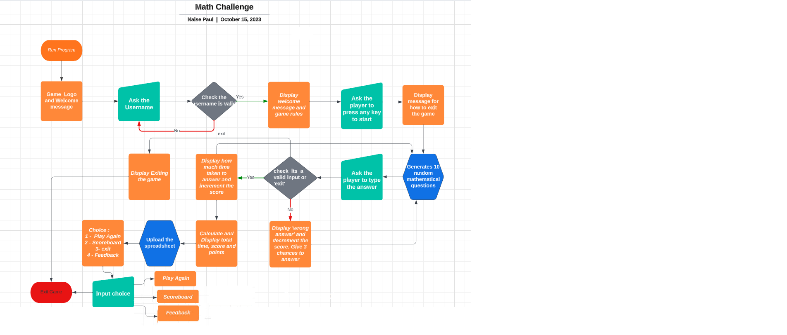

## Game Features

### Logo and welcome message

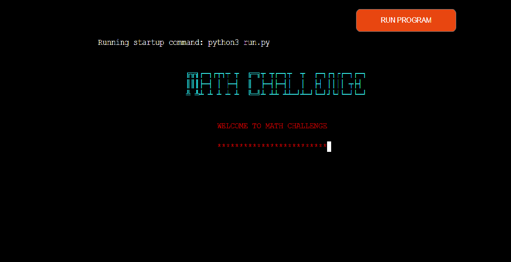

- When the users reach the website, the game logo and the introduction message are displayed here.

### Asking the username

- After the welcome message computer will ask to input the username.

### Error in username

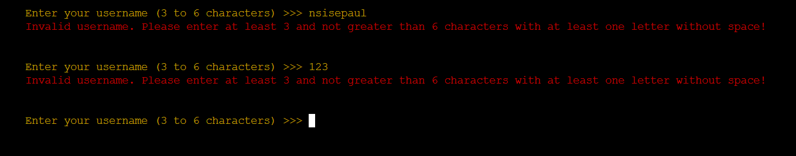

- If there is any error in the username, it will display error message.

### Game rule

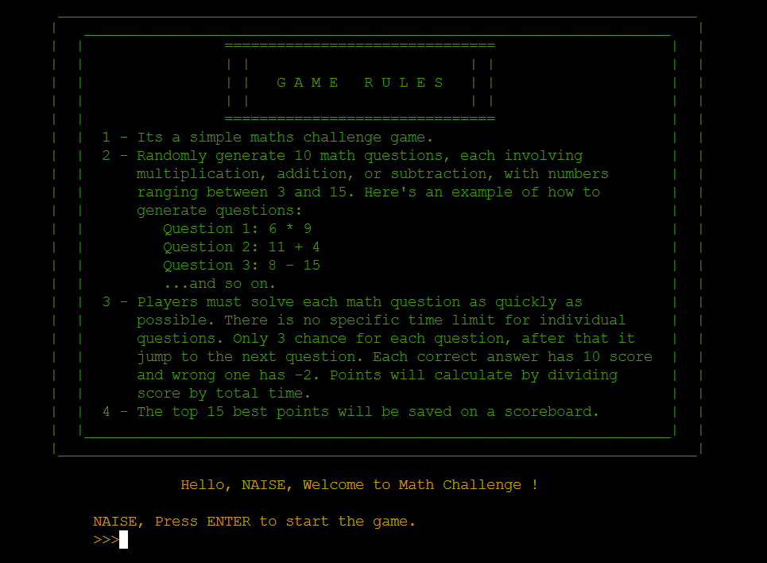

- After giving the correct username computer will display the game rules and give instruction to the player that to press a key to start the game.

[Back to Table of contents](#table-of-contents)

### Type 'exit' for exiting the game 

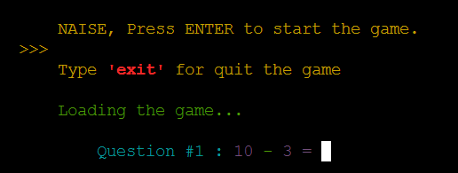

- Type 'exit' for exiting in between the game.

### Invalid input and wrong answer 

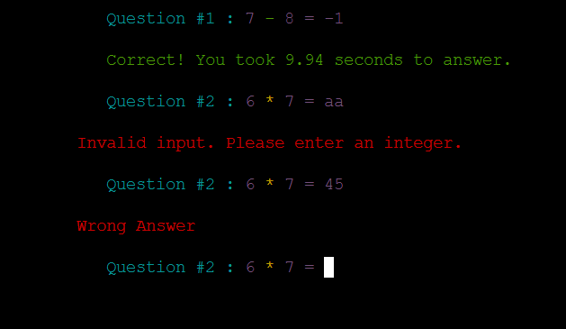

- When player typed wrong answer and invalid input these error message will shown.

### Jump to next question after 3 wrong answers

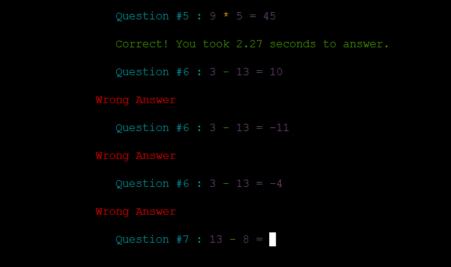

- Automatically jump to the next question if player entered 3 wrong answers

### Game over

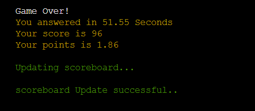

- When game is finished it will display game over message and total time, score and points.

### Menu Option

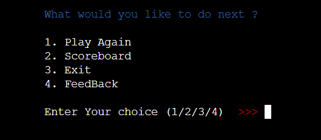

- At the end of the game players have access to the menu where they can choose from these options:

    [1] - Play Again

    [2] - Scoreboard

    [3] - Exit

    [4] - FeedBack

### Scoreboard

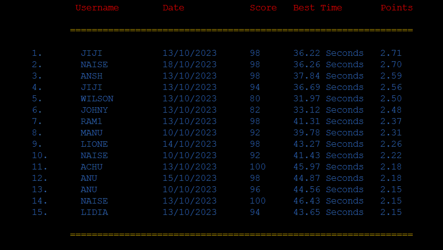

- The Scoreboard shows the 15 players with the best Points.

### Feedback

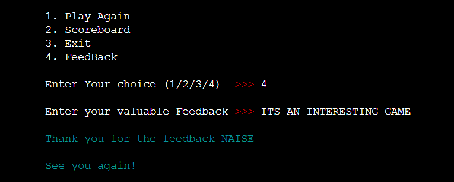

-  Player can input their feedback at the end

### End Game

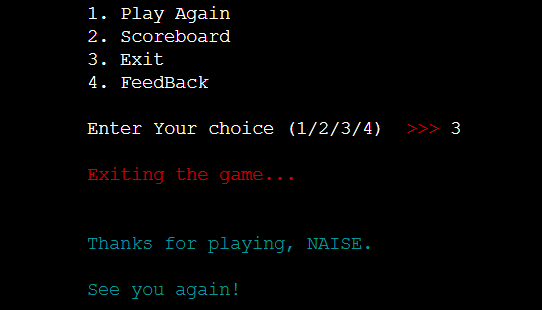

- Player can type 3 for exiting from the game. Player can see this message when they choose 'exit'
