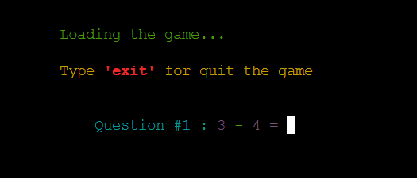
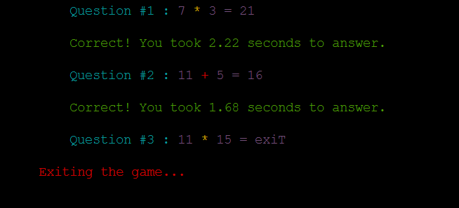

# MATH CHALLENGE

# Introduction

A math challenge game is an educational or entertainment game that test and improve's players math skill by presenting mathematical problems for them to solve.

Welcome to the [Math Challenge](https://math-challenge-8e3b27978092.herokuapp.com/). This Readme file provides an overview of my project milestone 3  which runs in Python Terminal. Please read through this documents to familiarize everyone with featues and guildlines.

[You can see the live project here](https://math-challenge-8e3b27978092.herokuapp.com/)

## [Table of Contents](#table-of-contents)

- [Introduction](#introduction)
- [User Experience](#user-experience)
  - [Website Owner goal](#website-owner-goal)
  - [User Goals](#user-goals)
  - [User Stories](#user-stories)
- [Surface](#surface)
- [Logic](#logic)
  - [Flowchart](#logic)
- [Game Features](#game-features)
  - [Logo and Welcome message](#logo-and-welcome-message)
  - [Asking the Username](#asking-the-username)
  - [Error in username](#error-in-username)
  - [Game rules](#game-rule)
  - [Exit the game](#type-'exit'-for-exiting-the-game)
  - [Invalid input and wrong answer](#invalid-input-and-wrong-answer)  
  - [Jump to the next question after 3 wrong answers](#jump-to-next-question-after-3-wrong-answers)
  - [Game Over](#game-over)
  - [Menu Option](#menu-option)
  - [Scorboard](#scoreboard)
  - [FeedBack](#feedback)
  - [End Game](#end-game)
- [How to Play](#how-to-play)
- [Storage Data](#storage-data)
- [Technologies Used](#technologies-used)
    - [Languages Used](#language-used)
    - [Python Packages](#python-packages)
    - [Frameworks](#frameworks---libraries---programs-used)
- [Testing](#testing)
    - [pep8ci](#python-validation)
    - [LightHouse](#lighthouse)
    - [Functionality](#functionality)

## User Experience

### Website Owner goal

- Entertainment and Education :

    The primary goal for math challenge game is to provide entertainment and educational skills to my users. It will improve their maths skills. I want to create an enjoyable and engaging experience that keeps visitors coming back to play the game.

### User Goals

- Entertainment :

    Solving mathematical problems in a game format can be engaging, fun and entertaining.

- Skill Improvement :

    Users may play the game to enhance their math skills, particularly their ability to perform quick calculations.

- Mental Stimulation :

    The game challenges players with math questions, requiring them to think and calculate quickly. This can provide mental stimulation and help improve math skills.

### User Stories

- The user wants to start the game with a simple click or command, so user can quickly begin playing.

- Provide a clear and concise set of instructions at the start, so user can understand how to play.

- User can enter their username so that the game can personalize their experience and save their scores.

- Provide a variety of math problems that include addition, subtraction, and multiplication, so user can test different math skills.

- Display the top 15 best players on the scoreboard, so user can strive to be among them.

- User have the option to quit the game at any time, so user can exit the game gracefully.

[Back to Table of contents](#table-of-contents)

## Surface

- Colors

    The colors in this game are supplied by the Python Colorama Model

## Logic

-  Flowcharts

## Game Features

### Logo and welcome message

- When the users reach the website, the game logo and the introduction message are displayed here.

### Asking the username

- After the welcome message computer will ask to input the username.

### Error in username

- If there is any error in the username, it will display error message.

### Game rule

- After giving the correct username computer will display the game rules and give instruction to the player that to press a key to start the game.

[Back to Table of contents](#table-of-contents)

### Type 'exit' for exiting the game 

- Type 'exit' for exiting in between the game.

### Invalid input and wrong answer 

- When player typed wrong answer and invalid input these error message will shown.

### Jump to next question after 3 wrong answers

- Automatically jump to the next question if player entered 3 wrong answers

### Game over

- When game is finished it will display game over message and total time, score and points.

### Menu Option

- At the end of the game players have access to the menu where they can choose from these options:

    [1] - Play Again

    [2] - Scoreboard

    [3] - Exit

    [4] - FeedBack

### Scoreboard

- The Scoreboard shows the 15 players with the best Points.

### Feedback

-  Player can input their feedback at the end

### End Game

- Player can type 3 for exiting from the game. Player can see this message when they choose 'exit'

[Back to Table of contents](#table-of-contents)

## How to Play

- After giving the players username and setting the game enviornment. Each question in the game, the function manages the presentation of the mathematical expression, handles players input, evaluate the answer and time taken  for each question. Scoring system allowing the player to earn score for each correct answers and deducted score for wrong answers. [Here is the game rules](#game-rule)

- Total 10 randomly questions will be there.

- Each question have 3 attempt for correct answer after that jump to next question. [Jump to the next question](#jump-to-next-question-after-3-wrong-answers)

- After finished all 10 questions player will get the result. [Result](#game-over)

## Storage Data

- I used a Google sheet to save the username, date, score,best time and points. This sheet is connected to the code through the Google Drive and Google Sheet API by the Google Cloud Platform. This method allows me to send and receive data as I had access to the Google Sheet API credentials. I also added in the Config Vars to these credentials when I was deploying the project in Heroku. As this is sensitive data, I had to add the creds.json in the Git ignore file. This would ensure that these credentials are not pushed to the repository.

### Code to connect to google sheet

### Google Sheet Math Challenge scoreboard

[Back to Table of contents](#table-of-contents)

## Technologies Used

### Language used

- [python](https://www.python.org/) - used extensively during project.

- [Markdown](https://www.markdownguide.org/) - Used exclusively for README.

- HTML5 - minor use when adding additional elements to the web page.

- CSS3 - minor use
 when applying styling to app view.

### Python packages

- [Random](https://docs.python.org/3/library/random.html) - Returns a random integer to get a random number ([randint()](https://www.digitalocean.com/community/tutorials/randint-method-in-python))

- [Colorama](https://pypi.org/project/colorama/) - Allows terminal text to be printed in different colours / styles

- [DateTime](https://docs.python.org/3/library/datetime.html) - Returns the full date

- [Time](https://docs.python.org/3/library/time.html) - Defined time sleep

- [Shutil](https://docs.python.org/3/library/shutil.html) - shutil. get_terminal_size() method tells the size of the terminal window. 

- [sys](https://docs.python.org/3/library/sys.html) - sys is used to control the output behavior of the program. Used sys for typewriter effect

- [os](https://docs.python.org/3/library/os.html) - Used for clear the screen 

- [Gspread](https://pypi.org/project/gspread/) - Allows communication with Google Sheets

- [Google.oauth2.service acoount](https://google-auth.readthedocs.io/en/stable/index.html) - credentials used to validate credentials and grant access to Google service accounts

### Frameworks - Libraries - Programs Used

- [Git](https://git-scm.com/)
    - Git is a version control system used for tracking changes in computer files. It is generally used for source code management in software development.

- [Github](https://github.com/)
    - GitHub is used to store the project's code after being pushed from Git

- [Heroku](https://dashboard.heroku.com/apps)
    - Heroku was used to deploy the live project

- [Lucidchart](https://lucid.app/users/login#/login)
    - Lucidchart used to create the flowchart

- [Patorjk](https://patorjk.com/)
    - Patorjk (ASCII Art Generator) used to draw the game heading

- [PEP8](https://ww1.pep8online.com/)
    - The PEP8 was used to validate all the Python code

[Back to Table of contents](#table-of-contents)    

## Testing

- ### Python Validation

- The [Code Institute's Python Linter](https://pep8ci.herokuapp.com/)  Service was used to validate every Python file in the project to ensure there were no syntax errors in the project.

- No errors or warnings were found during the testing.

### Lighthouse

- I run Lighthouse within the Chrome Developer Tools to test the performance, accessibility, best practices and SEO of the website.

### Functionality

- The terminal has no issues and is working properly

- The typewriter starts typing at the right time and is working correctly

- The input for username have the right behaviour and shows the user an alert if the input is empty or invalid

- The game rules appear without any issues after the player submits the username

- The option to press ENTER key to start the game is running well

- User can exit the game at any stage with typing 'exit' is working properly.

- Wrong message and invalid input message comes properly when player input invalid.

- The game runs without any issues and as expected

- At the end of the game, the scoreboard is updating correctly

- All the menu options are working without any fails

[Back to Table of contents](#table-of-contents)